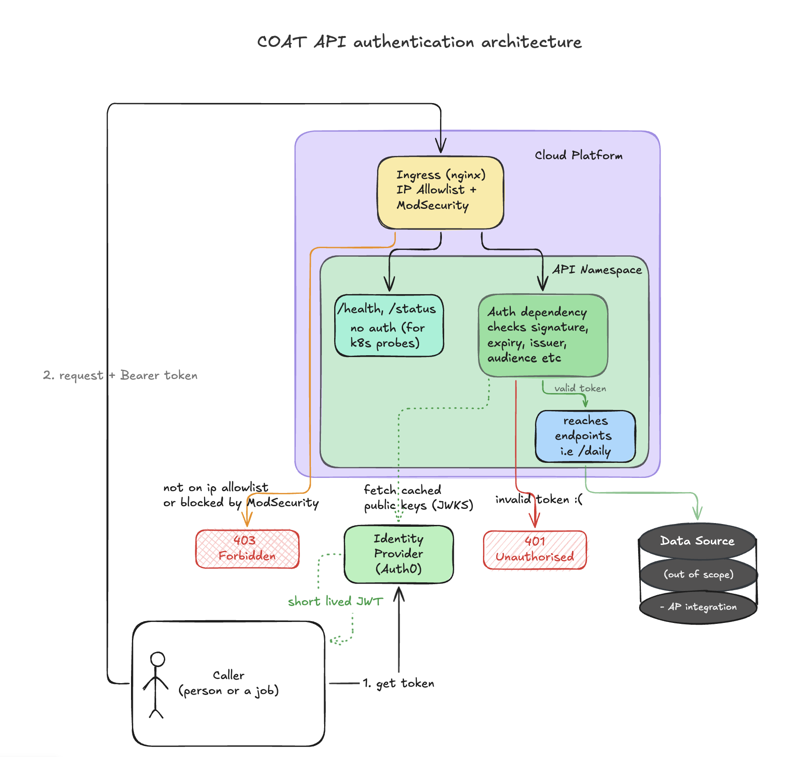

# API authentication approach

This documents the current direction for authenticating the COAT API.

**Date:** 2026-10-08
**Related:** #1059 (SPIKE: securing API - authentication), #1156 (Create ADR for COAT API authentication)

## Context

The COAT API will be hosted on Cloud Platform and used by internal MOJ teams. The data is internal and sensitive, and every request to any endpoint runs a database query, so unauthorised access is both a data and a cost risk. 

Spike #1059 looked at two layers of protection:

- **Network layer:** who can reach the API
- **Token layer:** who can use it once they reach it

I compared existing MOJ services and chose `laa-inquests-api` as the reference model. It's a FastAPI API on Cloud Platform with both layers running in production, which is the closest match to what we're building.

## Proposed approach

### Production

Follow the reference model.

**Network layer**

- IP allowlist on the Cloud Platform ingress (`nginx.ingress.kubernetes.io/whitelist-source-range`), with ranges supplied at deploy time rather than hard coded.
- MOJ VPN: callers must connect through the MOJ VPN, so their traffic comes from MoJ ranges and passes the allowlist. Anyone not on the VPN or an MOJ network is blocked at the ingress.
- ModSecurity with the OWASP core rules, starting in detection-only mode so we can check for false positives before blocking.

**Token layer**

- Callers get a short lived JWT from our identity provider and send it in the Authorization: Bearer header. The api never handles logins or passwords, and returns 401 rather than redirecting to a login page.
- A per-route FastAPI dependency validates the token before any route code runs. It checks signature, expiry, issuer and audience.
- The signature is checked using the identity provider's public keys (JWKS). `PyJWKClient` caches the keys in memory and refetches them automatically when the provider rotates keys, so the API holds no secret for token validation.
- `/health` and `/status` are left unauthenticated so Kubernetes probes can reach them.
- Any secrets are injected with Kubernetes `secretKeyRef`.

### MVP / POC

Keep it simple: a single static API token, created and managed by us, checked by a FastAPI dependency. 
The dependency sits in the same place as the future JWT dependency, so moving to production auth means swapping the dependency, not changing the routes.

## Consequences

**Positive**

- The production approach follows a pattern already running in MoJ, rather than something new.
- Bad requests are rejected before any query runs, so there's no data exposure or query cost
- Token validation needs no stored secret, and key rotation needs no manual work or redeploy
- The MVP is quick to build and doesn't block other work.

**Negative / trade-offs**

- The MVP credential identifies "has the credential", not who is calling. It may not expire and has to be rotated manually, so it isn't suitable for production.
- In production, callers have to get a token before calling the API, which adds a step for anyone testing by hand.
- The allowlist depends on finding an authoritative source for MoJ IP ranges. If none is available, we'd deploy with JWT validation and ModSecurity and add the allowlist later.
- `PyJWKClient` fetches keys synchronously, so the auth dependency should be a plain `def` rather than `async def` to avoid blocking the event loop.

## Open questions

- Identity provider: likely Auth0 with GitHub as the login connection, as GitHub is the current MOJ standard and other COAT services already use it. This would also allow access to be restricted by GitHub team membership later.
- Where should the allowlist IP ranges come from?
- Who are the first consumers? This decides how callers get tokens

## Out of scope

Outbound access from the API to its data source. That's covered by the separate AP integration ticket.